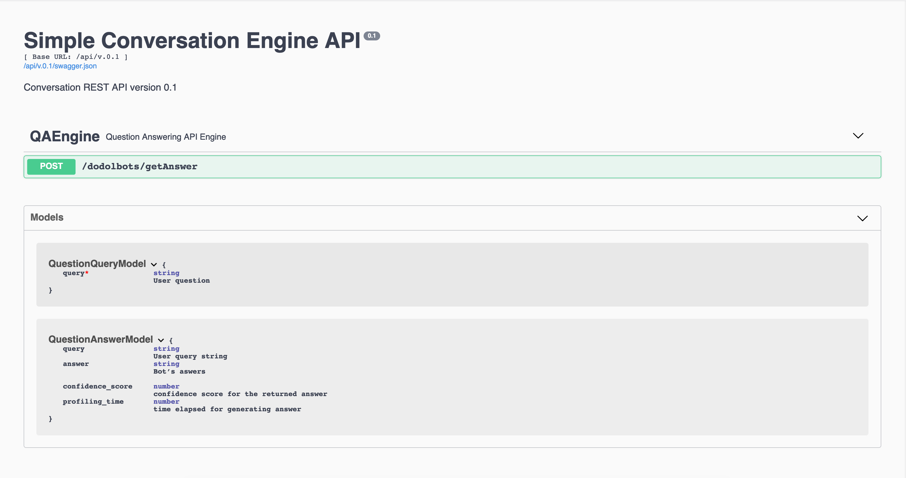
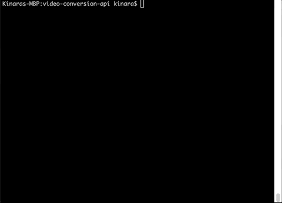
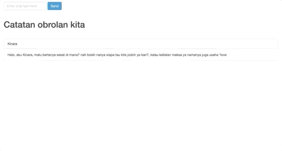
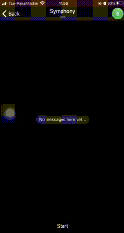

# Dodolbot, yet another simple Question Answering BOT API

Dodolbot is a simple project with simple question answering capability, the purpose of this project is to create simple chat bot using simple Question Answer pair dataset on top of websocket. the main objectives are:
- chat engine built with socket-io
- simple question answering model with only text similarity prediction. We use leveinsthein distance to calculate similarity from user question and our QnA pair datasets, dataset are single .xlsx file and can be found ```app/datasets/simple_qa_datasets.xlsx```
- greet connected users and giving goodby message if user are inactive for a time period
- (and, as a bonus) also connected telegram bot api, so telegram user can add bot and getting the question answer model access

The chat feature built with socket-io and the question answering model are available with REST HTTP API

ps. for telegram, i use getMessage api not utilizing webhook from telegram, since this just a test so no need to setting up a webhook from telegram hehe

## Project dependency
this project dependent on several libraries and frameworks such as:
- flask
- flask socket-io
- flask restplus
- gunicorn 
- gevent

for the QnA system using text similarity by Leveinsthein distance
- pandas
- python-leveinsthein

other detailed python packages needed by this project can be seen on requirements.txt

## Clone and Running the project using docker 
to run this project with docker, first you need to clone the repository
```
$ git clone <repo path>
```

run with docker-compose, first we need to copy ```.env.sample``` to ```.env``` and replace environments variables with your telegram token (if you want to use telegram as additional channel), and to execute the engine simply by using docer-compose command below
```bash
$ docker-compose up --build
```

to run with docker build, you can use the command below to bulid an run the container with additional environment variables and exposing ports
```bash
$ docker build . -t dodolbot
$ docker run -e TELEGRAM_BOT_TOKEN=your:telegram:token:here -p 8080:8080 dodolbot
```

## Api docs with Swagger
We use swagger for documenting the project API, the url for accessing api documentation is [http://localhost:8080/api/v.0.1/doc/](http://localhost:8080/api/v.0.1/doc/)


## Testing the API & Web Chat
You can try the API request directly from the swagger above



or using curl command 
```
curl -X POST "http://localhost:8080/api/v.0.1/dodolbots/getAnswer" -H  "accept: application/json" -H  "Content-Type: application/json" -d "{  \"query\": \"ibu kota negara indonesia?\"}"
```


or accessing the Web Chat by accessing http://localhost:8080/



or by telegram app




## Unittest
The simple testing script are available on ```app/tests``` directory, to make it simple we only utilize unittest python module for testing script dependency.

## Online demo
online demo might be available for this project, let me update later :)